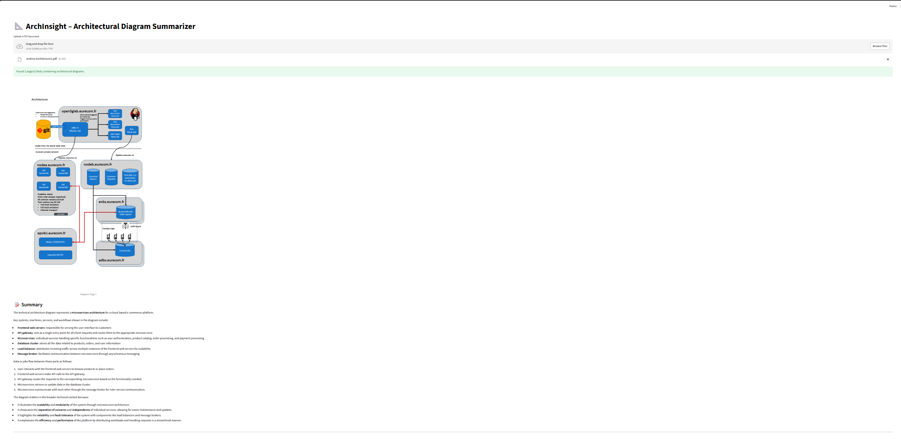

# 📐 ArchInsight – Architectural Diagram Summarizer

**ArchInsight** is a Streamlit-powered AI assistant that scans PDF documents, detects architectural diagrams, and provides contextual summaries using LLMs via LangChain. Designed to support engineers, architects, and technical reviewers, it makes it easy to extract insights from complex technical documents.

---

## ✨ Features

- 🧠 Automatically identifies pages with architectural diagrams based on surrounding text
- 📄 Renders full PDF pages to preserve vector lines, arrows, and layout
- 🤖 Uses OpenAI via LangChain to summarize diagrams and workflows
- 🎨 Contrast-enhanced previews for better visibility of light-on-dark content
- 💡 Clean and intuitive Streamlit interface

---

## 🖼️ Example Use Case

> Upload a technical design document (e.g., system architecture, CI pipeline) — ArchInsight will extract pages that likely contain diagrams and generate precise summaries like:
>
> - What the diagram represents
> - Key components/services shown
> - Flow of control or data
> - Why the diagram is relevant

---

## 🚀 Getting Started

### 1. Clone the Repository

```bash
git clone https://github.com/timayabi2020/ArchInsight.git
cd ArchInsight
```

### 2. Create and Activate a Virtual Environment

python -m venv venv
# Windows
venv\Scripts\activate
# macOS/Linux
source venv/bin/activate

### 3. Install Dependencies

pip install -r requirements.txt

### 4. Add Your OpenAI API Key

OPENAI_API_KEY=sk-XXXXXXXXXXXXXXXXXXXXXXXXXXXXXX
Alternatively, set the OPENAI_API_KEY in your system environment variables.

### 5. Run the App 

streamlit run app.py


<p align="center">
  
</p>
